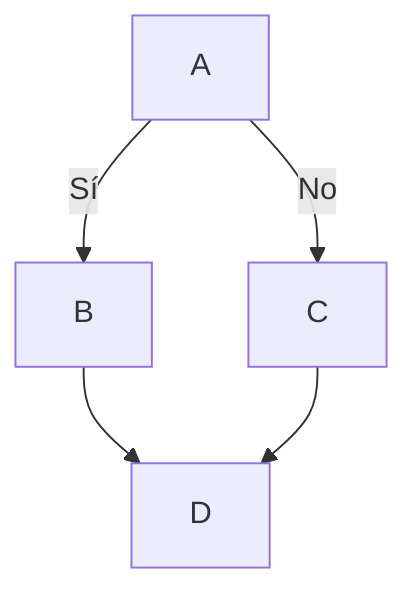

# Máster en Ingenieria Informatica - 23/24
## Aprendizaje y Enseñanza de la Tecnología 
### Test header with a logo


---


Student: **[Konrad Jan Pierzchlewicz](https://campusdoctoradoyposgrado2122.ull.es/user/profile.php?id=1156)** - [Konobono](https://github.com/Konobono)

You can send me an *e-mail* at `let email: str = "alu0101686226@ull.edu.es"`. To consult my experience in the Master's Degree and a brief CV, you can click on [this link](master.md). If you want to know about my objectives click [here](objectivos.md).


---

*Favourite quote:*
>The way to get started is to quit talking and begin doing. -Walt Disney


A work day for me is something like this:

```python
def break_or_not():

    number = random.randint(0, 100)
    print(number)

    if 0 > number > 100:
        break_time = True
    else:
        break_time = False
    print(break_time)

    return break_time

break_or_not()


```

## A list with no order

- Tomas
- Lucas
- Giorgio


## A list with order

1. Something
2. Something other
3. Some other thing

---
**Important link**:

[DeepL Translator](https://www.deepl.com/translator)

|      Redes Sociales       |                                                                                                                   |
| :-----------------------: | :---------------------------------------------------------------------------------------------------------------: |
[ULL academic profile](https://campusingenieriaytecnologia2324.ull.es/user/profile.php)
| ^^^ | 


## Inline code

In markdown you can put in a link like that: `[Some name to a link](link)` and this is an example of inline code

---

## Image


---

## A table

First Header | Second Header
  ------------ | -------------
  Content from cell 1 | Content from cell 2
  Content in the first column | Content in the second column
  

:+1:

## Math

$$ P = \frac {a^2 \sqrt {3}}{4}$$

---

## Diagram




## Task list

- [x] Apprender tutorial
- [ ] Catch-up
- [ ] Add delight to the experience when all tasks are complete :+1:


